### Cypress, Github action and github secrets prototype 

This is a prototype to test Cypress with github secrets in the pipeline.

#### Prerequisites 
Add the secrets in your github repository
##### Github repository secrets:

1. Go to settings


2. Go to Secrets and variables and click Actions
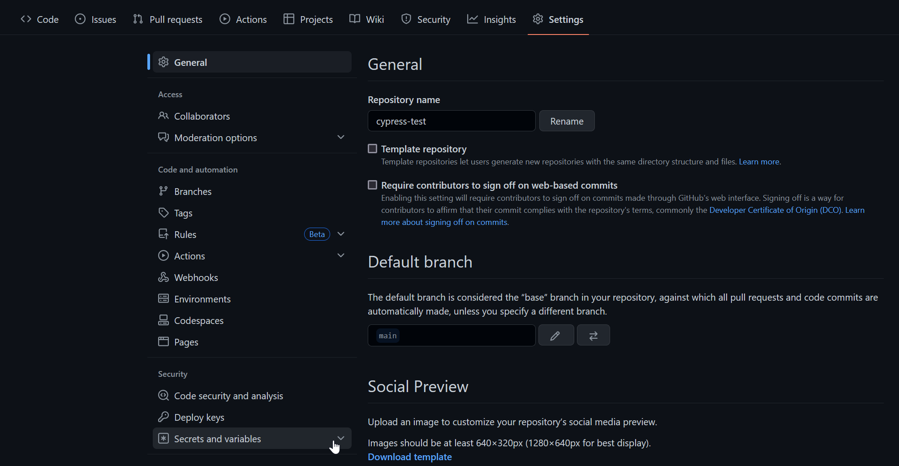

3. Add a new repository secret on **New repository secret**


4. Then add a new secret, this is for email
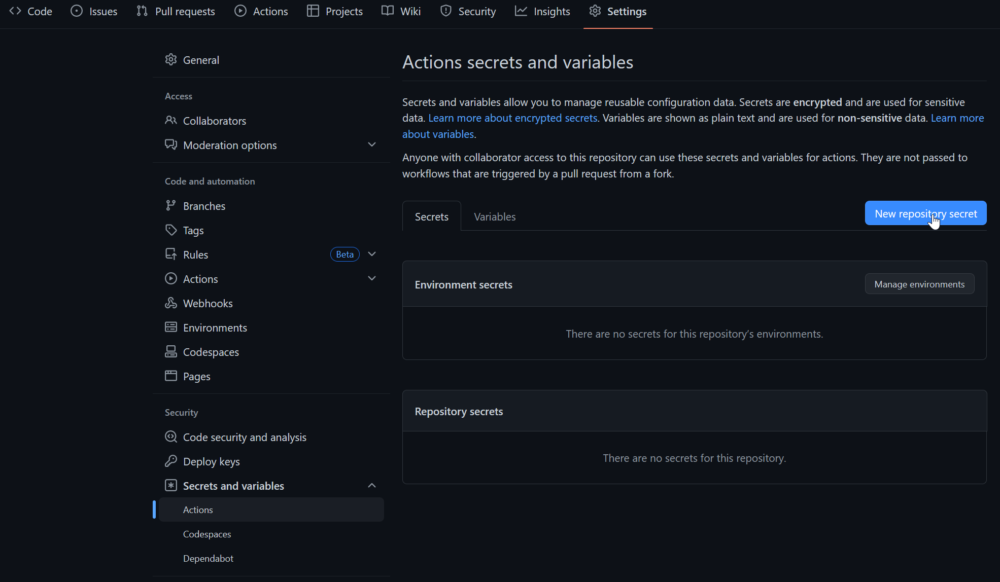

5. Then add one more for password
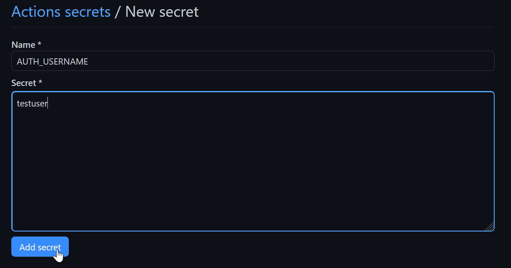


6. And add password secret
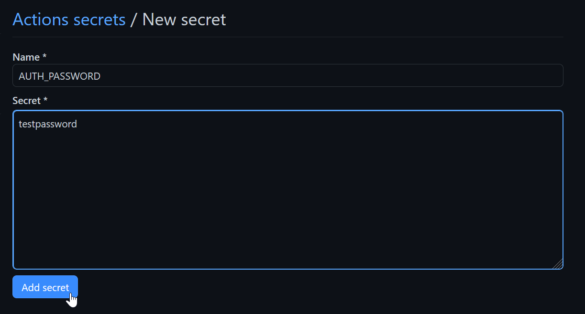

7. Then you can see your added secrets under **Repository secrets**
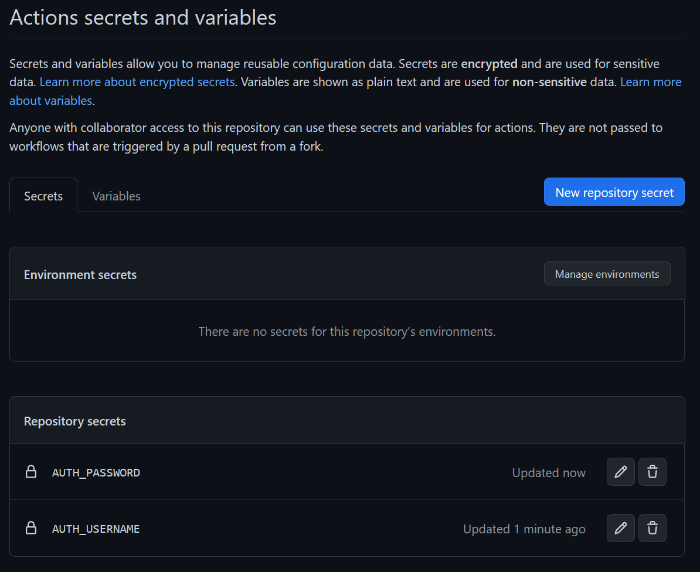

<br>
##### Github environment secrets

1. Click on **Manage environments**
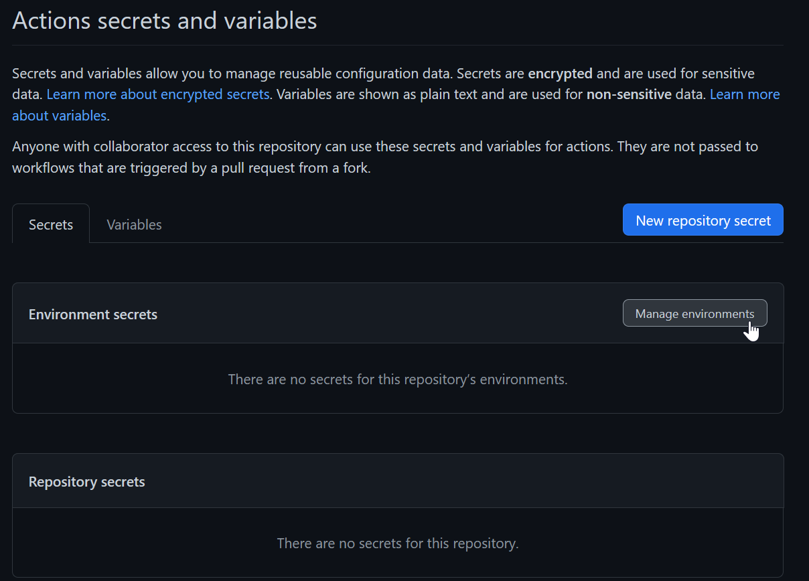

2. Then click on **New environment**
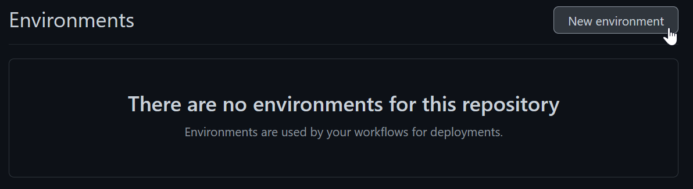

3. Name your new enviroment and add it
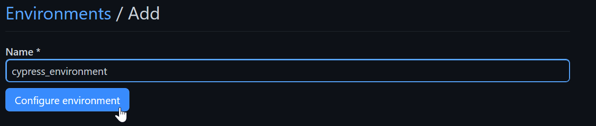

4.  In the **Environments** tab under **Code and automation** you will see your enviroments. There you can add a environment secret
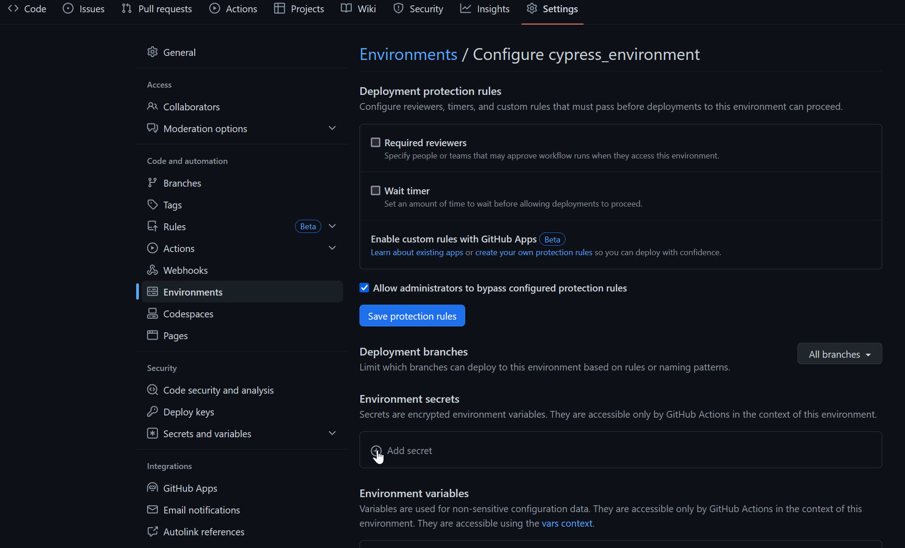

5. Add a username secret.
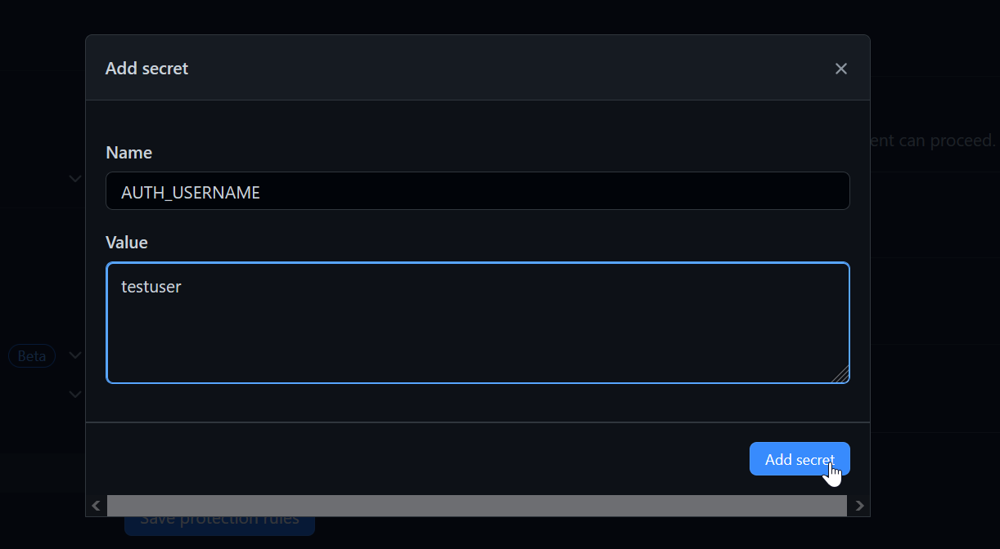

6. then add a password secret as well. 
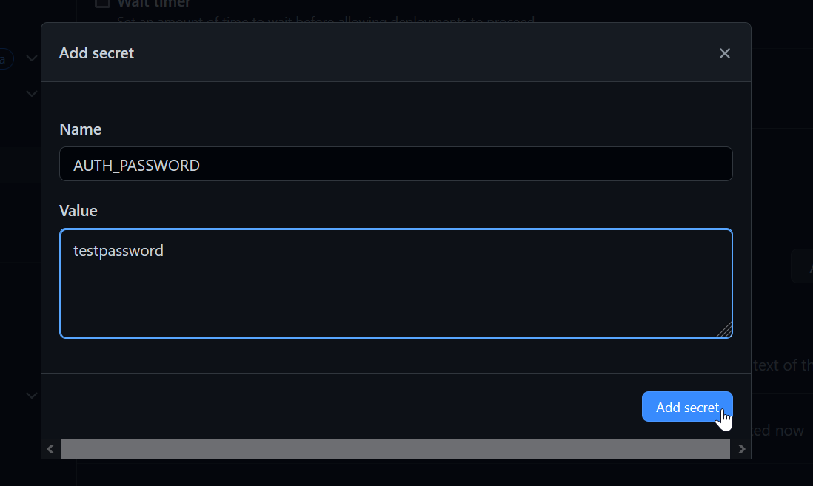

7. Then you can see your added secrets under **Environment secrets** in your enviroment you created before.
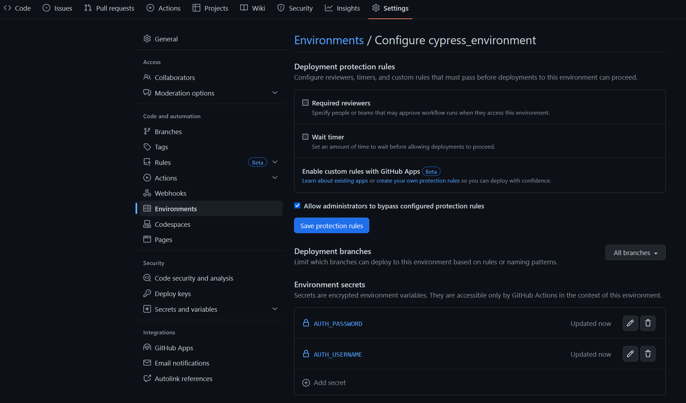

<br>
**Note**
When using environment you need to specify it in your pipeline ```.github/workflows/main.yml``` like ```environment: cypress_environment```.
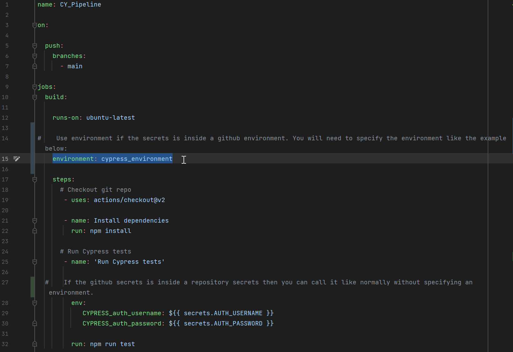


#### Explanation: 
In order to pass the github secrets into your cypress environment. You need to add
```CYPRESS_``` and then your environment name.
In pipeline: ```.github/workflows/main.yml```

In cypress config file: ```cypress.config.js```


Then it can be used in your cypress e2e testing: ```cypress/e2e/login-test.cy.js```


<br>
When you push a change to your main branch, you will trigger github actions which you can find under the **Actions** tab. There you can see the cypress test running.

### using dependencies
```
@vue/cli
cypress
concurrently
```

### Project setup
```
npm install
```

### Compile and Hot-Reload for Development

```
npm run dev
```
