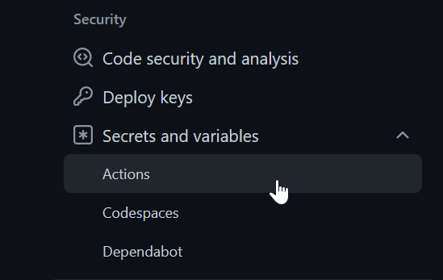

### Cypress, Github action and github secrets prototype 

This is a prototype to test Cypress with github secrets in the pipeline.

#### Prerequisites 
Add the secrets in your github repository
Github repository secrets:
1. 
2. 
3. 
4. 
5. 
and add password secret:
6. 
7. 

Github environment secrets:
1. 
2. 
3. 
4. 
5. 
6. 
7. 
*Note*
When using environment you need to specify it in your pipeline ```.github/workflows/main.yml``` like ```environment: cypress_environment```.


#### Explanation: 
In order to pass the github secrets into your cypress environment. You need to add
```CYPRESS_``` and then your environment name.
In pipeline: ```.github/workflows/main.yml```

In cypress config file: ```cypress.config.js```


Then it can be used in your cypress e2e testing: ```cypress/e2e/login-test.cy.js```


### using dependencies
```
@vue/cli
cypress
concurrently
```

### Project setup
```
npm install
```

### Compile and Hot-Reload for Development

```
npm run dev
```
